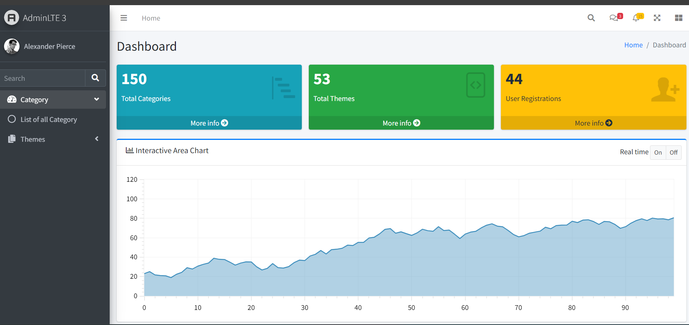
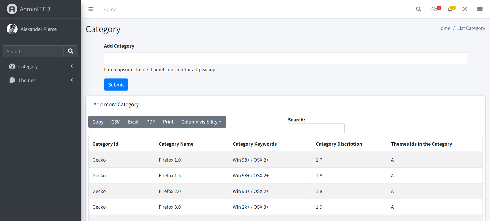
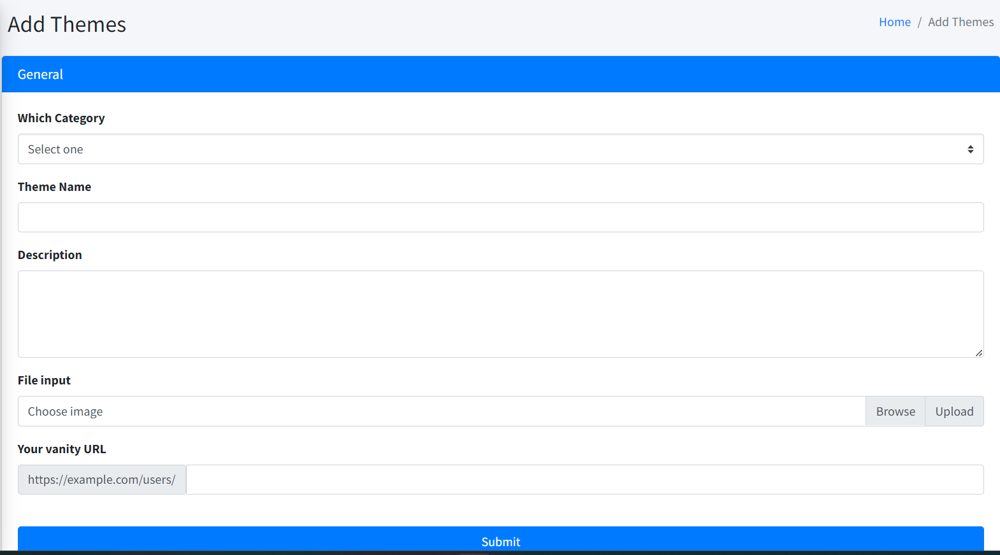

# Admin Panel Project

This project is an admin panel developed using Bootstrap and PHP. The contributors for this project are Ashad and Satyam.

## Project Overview

The admin panel provides a user-friendly interface for managing various aspects of a website or application. It includes features such as user management, content management

## Technologies Used

* Bootstrap: A popular CSS framework for designing responsive and mobile-first websites.
* PHP: A server-side scripting language for web development.

## Getting Started

To get started with this project, follow these steps:

1. Clone the repository to your local computer. You can do this by running the following command in your terminal or command prompt:

2. Navigate to the `admin-php-project_23` directory:

3. Open the `index.php` file in your web browser to view the admin panel.

Note: If you are using XAMPP, you will need to place the `admin-php-project_23` directory in the `htdocs` folder in your XAMPP installation directory. Then, you can access the admin panel by navigating to `http://localhost/admin-php-project_23` in your web browser.

## Screenshots

Here are some screenshots of the admin panel:

## Contact

If you have any questions or comments about this project, please contact Ashad or Satyam.
